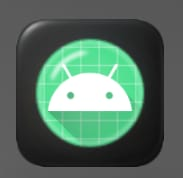

# Tugas Mengubah Ikon Aplikasi

**Nama:** FarrelGhozy  
**NIM:** 452024611053  
**Kelas:** TI5A2  

> ⚠️ **Disclaimer:** isi aplikasi ini cuma dummy ya, bukan aplikasi beneran. cuma buat tugas doang.

---

## 📱 Tentang Proyek

jadi tugas ini ikutin Google Codelab tentang ganti ikon aplikasi pake Jetpack Compose + Kotlin. intinya belajar cara bikin adaptive icon biar ikon aplikasi keliatan profesional.

### tujuan nya:
- ngerti cara kerja adaptive icon (ada layer foreground & background)
- ganti ikon pake vector drawable
- bikin legacy icon biar kompatibel sama Android lama

---

## 🎨 Perbandingan Ikon

| Ikon Lama | Ikon Baru |
|---|---|
|  |  |

ikon baru pake gradient **biru (#4158D0) → ungu (#C850C0)** sama foreground **segitiga play putih**, temanya media streaming.

| Adaptive Icon | Legacy Icons |
|---|---|
| `drawable/ic_launcher_background.xml` | `mipmap-mdpi/ic_launcher.webp` (48×48) |
| `drawable/ic_launcher_foreground.xml` | `mipmap-hdpi/ic_launcher.webp` (72×72) |
| `mipmap-anydpi-v26/ic_launcher.xml` | `mipmap-xhdpi/ic_launcher.webp` (96×96) |
| `mipmap-anydpi-v26/ic_launcher_round.xml` | `mipmap-xxhdpi/ic_launcher.webp` (144×144) |
| | `mipmap-xxxhdpi/ic_launcher.webp` (192×192) |

---

## 📄 Tampilan Aplikasi

aplikasinya scrolling doang isinya konten dummy:

- **Header** — nama + nim (FarrelGhozy, 452024611053)
- **Video Player** — kotak gradient yang keliatan kayak player video + tombol play
- **Popular Videos** — 3 thumbnail video (Introduction, Tutorial, Review)
- **Categories** — chip filter (All, Music, Sports, Gaming, News)
- **About** — deskripsi singkat

> ini semua cuma dummy biar keliatan isi aja, gak ada fungsi real.

---

## 🎥 Demo

<video src="assets/demo.mp4" controls width="100%"></video>

---

## 🛠️ Teknologi

| | |
|---|---|
| Kotlin | 2.2.10 |
| AGP | 9.1.1 |
| Compose BOM | 2026.02.01 |
| Material 3 | ✅ |
| Adaptive Icon | ✅ |

---

## 🚀 Cara Jalanin

1. buka pake **Android Studio**
2. tunggu gradle sync
3. klik **Run** atau tinggal ketik:
   ```bash
   ./gradlew assembleDebug
   ```
4. install APK di emulator / hp (min SDK 35)

---

<p align="center">
  <i>tugas pemroganan android — semester 5</i>
</p>
